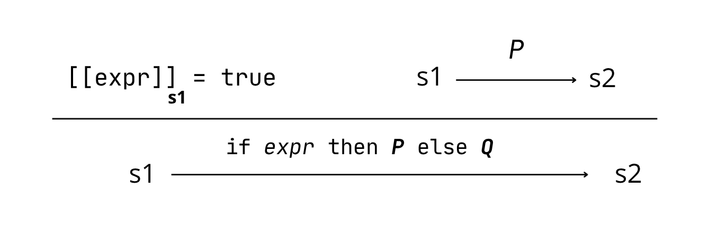
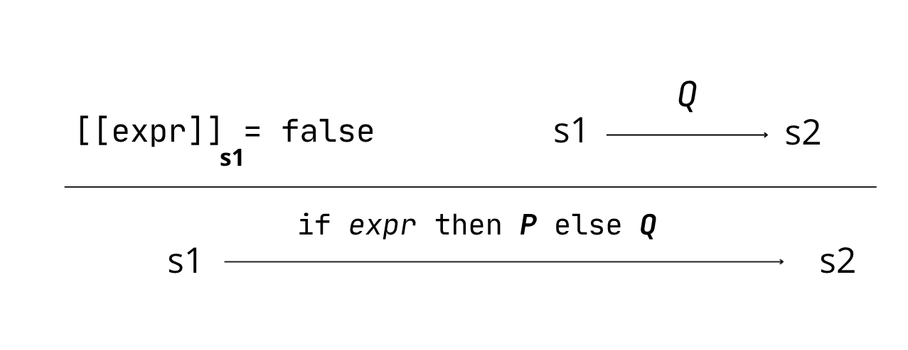

# Projet_LTPF

Auteur : Emilio STIEN & Kelig LE MARREC <br>
Date : Novembre 2025 <br>

--- 

## 1 - Préliminiaires théoriques

### 1.1.2 Définition et analyse d’un langage de programmation simple


### WHILEb⁻⁻

Une première Grammaire (récursive à gauche indirecte) : 

  Grammaire :

  * **Var** ::= 'a' | 'b' | 'c' | 'd'<br>
  * **Cst** ::= 0 | 1<br>
  * **Expr** ::= Cst | Var<br>
  * **Instr** ::= Assign | Seq | If | While | epsilon<br>
  * **Assign** ::= Var ':' '=' Expr<br>
  * **Seq** ::= Instr ';' Instr <br>
  * **If** ::= 'i' '(' Var ')' '{' Prog '}' '{' Prog '}'<br>
  * **While** ::= 'w' '(' Var ')' '{' Prog '}'<br>
  * **Prog** ::= Prog ';' Instr | Instr<br>


->  En effet, lorsque qu'on appelle une instruction, cela peut
    être une séquence qui elle même est constituée de suites d'instruction ect. <br>
==> On s'embarque dans une boucle infinie.


### 1.1.3 Grammaire non récursive à gauche 


  Grammaire :

  * **Var** ::= 'a' | 'b' | 'c' | 'd'<br>
  * **Cst** ::= 0 | 1<br>
  * **Expr** ::= Cst | Var<br>
  * **Instr** ::=  Assign | If | While<br>
  * **InstrSuite** ::= ';' Instr InstrSuite | epsilon<br>
  * **Assign** ::= Var ':' '=' Expr<br>
  * **If** ::= 'i' '(' Var ')' '{' Prog '}' '{' Prog '}'<br>
  * **While** ::= 'w' '(' Var ')' '{' Prog '}'<br>
  * **Prog** ::= Instr InstrSuite | epsilon <br>


### WHILEb


### 1.1.4 Grammaire pour le langage WHILEb


* **C** ::= '0' | '1' <br>
* **V** ::= 'a' |'b' | 'c' | 'd'<br>
* **A** ::= C | V<br>
* **F** ::= '!' F | A | '(' E ')'<br>

* **E** ::= T SE<br>
* **SE** ::= '+' T SE | epsilon<br>

* **T** ::= F ST<br>
* **ST** ::= '.' F ST | epsilon <br>


### 1.2 Sémantique Naturelle (SN)

#### 1.2.1 Règles SN pour If 

| If true  | If false  |
|----------|-----------|
|  |  |

-> Cette sémantique naturelle du If évalue l'expression depuis l'état initial s1. 
- **true** : à partir de l'état s1, on aboutit à l'état final s2 en exécutant P.
- **false** : à partir de l'état s1, on aboutit à l'état final s2 en exécutant Q'.

--- 

## 2 - Partie Principale

### 2.1.1 Analyseur syntaxique dulangage WHILEb⁻⁻

Pour implémenter la grammaire du langage WHILEb⁻⁻, nous avons
réalisé un analyseur syntaxique à l'aide des fichiers analist et anacomb 
vu en cours.

Notre grammaire utilise des appels mutuels entre les différentes règles
de la grammaire. On a utilisé le mot clé `and`.

==> Si le parseur rencontre une erreur de syntaxe, il lève une exception sinon il renvoie une ranalist vide si le programme total donné est correct, ou une partie du programme (en liste de caractères) si le programme est partiellement correct.

### 2.1.2 Tests

Voir tests sur le fichier projet.ml.

  
  ```
  Fibonnacci :

    a:=1;
    b:=0;
    c:=0;
    w(a){         ==> renvoie une char analist : []
      d:=b;   
      b:=a;
      a:=d;
     }
  ```

NB : Pour accepter toutes les varialbles de 'a' à 'z', on peut utiliser la fonction `terminal_cond` et avoir la condition : <br>

`(fun c -> c >= 'a' && c <= 'z')`.


### 2.1.3 Analyseur syntaxique du langage WHILEb

Fichier `projet.ml`.


### 2.1.4 Ajouts de contraintes : espaces, indentations, retours lignes

Le but de notre analyseur syntaxique est de pouvoir analyser des programmes avec des espaces, des indentations et des retours à la ligne.

Pour cela, nous pouvons définir une règle `Esp` de notre grammaire en utilisant l'étoile de Kleene `*`.

  * **Esp** ::= (' '  | '\n'  | '\t') * <br>

  * **C** ::= Esp ('0' | '1') Esp<br>
  * **V** ::= Esp ('a' |'b' | 'c' | 'd') Esp<br>
  * **A** ::= C | V<br>
  * **F** ::= Esp '!' Esp  F | A | Esp '(' Esp E Esp ')' Esp<br>

  * **E** ::= T SE<br>
  * **SE** ::= Esp '+' Esp T SE | epsilon<br>

  * **T**  ::= F ST<br>
  * **ST** ::= Esp '.' Esp F ST | epsilon <br>

  * **Instr** ::=  Assign | If | While<br>
  * **InstrSuite** ::= Esp ';' Esp Instr InstrSuite | epsilon<br>
  * **Assign** ::= Var Esp ':' '=' Esp Expr<br>
  * **If** ::= Esp 'i' Esp '(' Esp Var Esp ')' Esp '{' Esp Prog Esp '}' Esp '{' Esp Prog Esp '}' Esp<br>
  * **While** ::= Esp 'w' Esp '(' Esp  Var Esp ')' Esp '{' Esp  Prog Esp '}' Esp<br>
  * **Prog** ::= Esp Instr InstrSuite Esp | epsilon<br>

## 2.2 Éxécution d'un programme WHILEb

Tous les tests du programme WHILEb se trouvent dans le fichier `projet.ml`.

## 2.3 Preuves sur la SN 

Toutes les preuves de SN se trouvent dans le fichier `TD06_SN_winstr.v`.

---

## 3 - Partie optionelle

### 3.1 - Preuves sur la SOS

Toutes les preuves de SOS se trouvent dans le fichier `TD07_SOS_winstr.v`.


